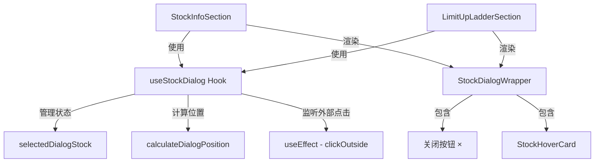

# 设计文档

## 概述

本设计将 StockInfoSection 和 LimitUpLadderSection 两个模块中 StockHoverCard 的触发方式从鼠标悬停（hover）统一改为点击（click）触发，并增加关闭按钮和点击外部关闭功能。

核心设计思路是提取共享逻辑，避免两个模块各自重复实现相同的 Dialog 管理、定位计算和关闭行为。

## 架构

### 整体架构



### 变更策略

1. 移除两个模块中所有 hover 相关逻辑（定时器、mouseEnter/mouseLeave 处理）
2. 提取共享的 `useStockDialog` 自定义 Hook 管理 Dialog 状态和定位
3. 提取共享的 `StockDialogWrapper` 组件封装关闭按钮和外部点击关闭
4. 提取纯函数 `calculateDialogPosition` 处理视口边界检测

## 组件和接口

### 1. `useStockDialog` Hook

```typescript
// hooks/useStockDialog.ts

interface DialogState {
  stock: Stock | null;       // 当前显示的股票，null 表示关闭
  position: { x: number; y: number }; // Dialog 的 fixed 定位坐标
}

interface UseStockDialogReturn {
  dialogState: DialogState;
  openDialog: (stock: Stock, clickEvent: React.MouseEvent) => void;
  closeDialog: () => void;
  dialogRef: React.RefObject<HTMLDivElement>; // 用于外部点击检测
}

function useStockDialog(): UseStockDialogReturn;
```

职责：
- 管理当前打开的 Dialog 股票和位置状态
- `openDialog`：根据点击事件坐标计算 Dialog 位置，设置当前股票
- `closeDialog`：清空当前股票，关闭 Dialog
- 注册 `mousedown` 事件监听器，检测点击是否在 Dialog 外部，若是则关闭
- 点击同一行/卡片时关闭 Dialog（toggle 行为）
- 点击不同行/卡片时切换到新股票

### 2. `calculateDialogPosition` 纯函数

```typescript
// utils/calculateDialogPosition.ts

interface PositionInput {
  clickX: number;          // 点击的 clientX
  clickY: number;          // 点击的 clientY
  dialogWidth: number;     // Dialog 宽度
  dialogHeight: number;    // Dialog 高度
  viewportWidth: number;   // 视口宽度
  viewportHeight: number;  // 视口高度
  gap?: number;            // 点击位置与 Dialog 的间距，默认 15
  padding?: number;        // 视口边缘安全间距，默认 10
}

interface PositionOutput {
  x: number;  // Dialog left 值
  y: number;  // Dialog top 值
}

function calculateDialogPosition(input: PositionInput): PositionOutput;
```

定位算法：
1. 默认将 Dialog 放在点击位置右侧（`clickX + gap`），垂直居中偏上（`clickY - dialogHeight / 4`）
2. 若右侧放不下（`x + dialogWidth > viewportWidth - padding`），则放到左侧（`clickX - dialogWidth - gap`）
3. 若底部超出（`y + dialogHeight > viewportHeight - padding`），向上调整（`viewportHeight - dialogHeight - padding`）
4. 若顶部超出（`y < padding`），对齐到顶部（`padding`）

### 3. `StockDialogWrapper` 组件

```typescript
// components/StockDialogWrapper.tsx

interface StockDialogWrapperProps {
  stock: Stock;
  position: { x: number; y: number };
  onClose: () => void;
  dialogRef: React.RefObject<HTMLDivElement>;
  onSizeChange?: (size: { width: number; height: number }) => void;
}

const StockDialogWrapper: React.FC<StockDialogWrapperProps>;
```

职责：
- 使用 `fixed` 定位渲染在指定坐标
- 右上角渲染关闭按钮（× 图标），点击触发 `onClose`
- 关闭按钮具有 hover 状态颜色变化
- 内部渲染 `StockHoverCard` 组件
- 通过 `dialogRef` 支持外部点击检测

### 4. StockInfoSection 变更

移除的逻辑：
- `hoverTimeoutRef`、`closeTimeoutRef`、`mousePosRef` 相关 ref
- `handleRowMouseEnter`、`handleRowMouseMove`、`handleRowMouseLeave` 函数
- `handleCardMouseEnter`、`handleCardMouseLeave` 函数
- `getCardStyle` 函数
- `hoveredStock`、`cardPos` 状态
- 表格行上的 `onMouseEnter`、`onMouseMove`、`onMouseLeave` 事件绑定
- 底部 hover card portal 渲染块

新增的逻辑：
- 引入 `useStockDialog` Hook
- 表格行 `onClick` 中调用 `openDialog(stock, event)`（保留原有的 `setSelectedStock` 逻辑）
- 使用 `StockDialogWrapper` 渲染 Dialog

### 5. LimitUpLadderSection 变更

移除的逻辑：
- `hoverTimeoutRef`、`closeTimeoutRef`、`mousePosRef` 相关 ref
- `handleMouseEnter`、`handleMouseMove`、`handleMouseLeave` 函数
- `openHoverCard`、`startCloseTimer`、`closeHoverInstant`、`updateHoverCardPosition` 函数
- `hoveredStock`、`cardPos`、`hoverCardSizeRef` 状态/ref
- 股票卡片上的 `onMouseEnter`、`onMouseMove`、`onMouseLeave` 事件绑定
- 底部 hover card 渲染块（含已有的关闭按钮）

新增的逻辑：
- 引入 `useStockDialog` Hook
- 股票卡片 `onClick` 中调用 `openDialog(stock, event)`（保留原有的 `setSelectedStockSymbol` 逻辑）
- 使用 `StockDialogWrapper` 渲染 Dialog

## 数据模型

本功能不涉及新的数据模型。复用现有的 `Stock` 类型作为 Dialog 的数据源。

状态变更：
- 原来的 `hoveredStock: Stock | null` 改为由 `useStockDialog` 内部管理的 `dialogState.stock`
- 原来的 `cardPos: { x: number; y: number }` 改为由 `calculateDialogPosition` 计算的 `dialogState.position`

## 正确性属性

*属性是在系统所有有效执行中都应成立的特征或行为——本质上是关于系统应该做什么的形式化陈述。属性是人类可读规范与机器可验证正确性保证之间的桥梁。*

### 属性 1：Dialog 视口包含性

*对于任意*有效的点击坐标 (clickX, clickY) 和任意有效的视口尺寸 (viewportWidth, viewportHeight)，`calculateDialogPosition` 计算出的 Dialog 位置 (x, y) 应确保 Dialog 完全在视口内，即：`x >= 0` 且 `x + dialogWidth <= viewportWidth` 且 `y >= 0` 且 `y + dialogHeight <= viewportHeight`。

**验证需求: 4.2, 4.3, 4.4**

### 属性 2：Dialog 单例性

*对于任意*股票序列 [S1, S2, ..., Sn]，依次调用 `openDialog` 后，`dialogState.stock` 应始终等于最后一次调用的股票 Sn，且不会同时存在多个 Dialog。

**验证需求: 1.2, 3.2**

## 错误处理

| 场景 | 处理方式 |
|------|---------|
| 点击位置坐标异常（NaN/负数） | `calculateDialogPosition` 将坐标 clamp 到 `[padding, viewport - padding]` 范围 |
| 视口尺寸小于 Dialog 尺寸 | Dialog 位置设为 `(0, 0)`，允许溢出但保证左上角可见 |
| StockHoverCard 加载失败 | 保留现有的 `Suspense fallback` 加载指示器 |
| 快速连续点击不同行 | `useStockDialog` 使用同步状态更新，最后一次点击生效 |

## 测试策略

### 属性测试

使用 `fast-check` 库进行属性测试，每个属性最少运行 100 次迭代。

- `calculateDialogPosition` 视口包含性属性测试
  - 生成随机的 clickX、clickY、viewportWidth、viewportHeight、dialogWidth、dialogHeight
  - 验证输出位置确保 Dialog 在视口内
  - 标签: **Feature: 001-stock-card-click-trigger, Property 1: Dialog 视口包含性**

- `useStockDialog` 单例性属性测试
  - 生成随机的股票序列和点击事件
  - 验证每次 openDialog 后只有最新股票可见
  - 标签: **Feature: 001-stock-card-click-trigger, Property 2: Dialog 单例性**

### 单元测试（示例测试）

- StockInfoSection：点击表格行弹出 Dialog（需求 1.1）
- StockDialogWrapper：关闭按钮存在且可点击关闭（需求 2.1, 2.2）
- StockDialogWrapper：点击外部区域关闭 Dialog（需求 2.3）
- LimitUpLadderSection：点击股票卡片弹出 Dialog（需求 3.1）
- LimitUpLadderSection：关闭按钮功能保留（需求 3.4, 3.5）

### 冒烟测试

- 确认 StockInfoSection 中 hover 相关逻辑已移除（需求 1.3, 1.4）
- 确认 LimitUpLadderSection 中 hover 相关逻辑已移除（需求 3.3）
