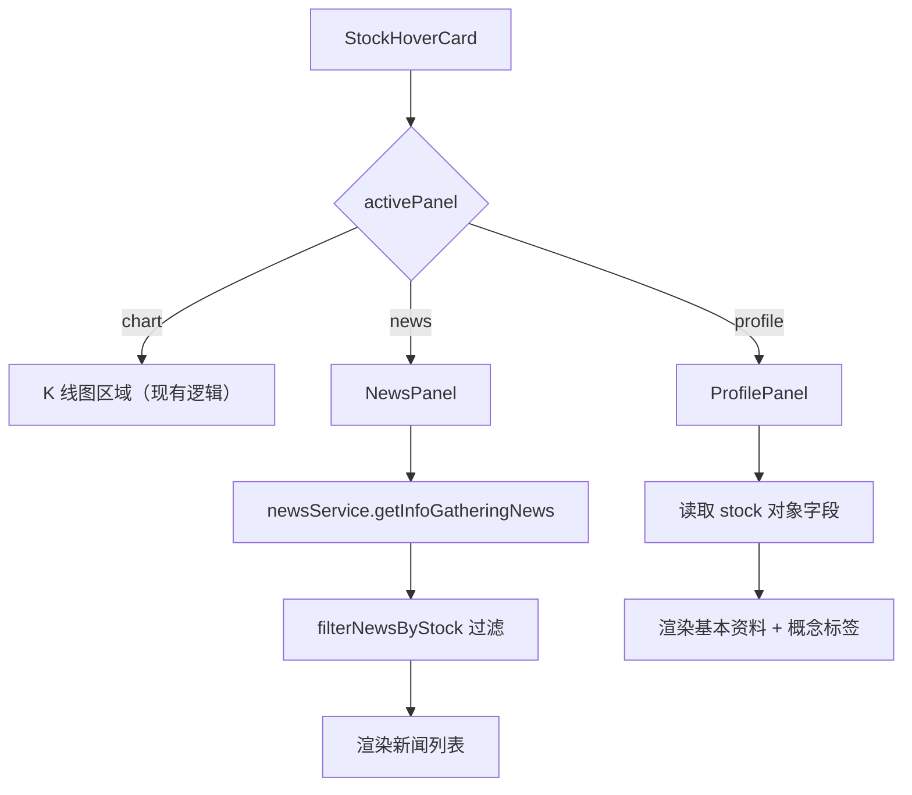

# 设计文档

## 概述

本设计为 StockHoverCard 组件实现"个股资讯"和"个股资料"两个按钮的交互功能。核心思路是在 StockHoverCard 内部引入面板状态管理，通过 `activePanel` 状态控制 K 线图区域的内容切换，实现 NewsPanel（个股资讯面板）和 ProfilePanel（个股资料面板）的展示。

两个面板互斥显示，替换 K 线图区域的内容。新闻数据复用已有的 `newsService.ts`，通过股票名称/代码对新闻进行过滤匹配。股票资料直接从 `Stock` 对象读取已有字段。

## 架构

### 状态管理

在 StockHoverCard 组件内新增 `activePanel` 状态：

```typescript
type PanelType = 'chart' | 'news' | 'profile';
const [activePanel, setActivePanel] = useState<PanelType>('chart');
```

面板切换逻辑（toggle 行为）：
- 点击"个股资讯"：若当前为 `'news'` 则切回 `'chart'`，否则切到 `'news'`
- 点击"个股资料"：若当前为 `'profile'` 则切回 `'chart'`，否则切到 `'profile'`

### 渲染流程



## 组件与接口

### 1. StockHoverCard 修改

在现有组件中新增：
- `activePanel` 状态及 `togglePanel` 切换函数
- 在 K 线图容器区域根据 `activePanel` 条件渲染不同内容
- 底部"个股资讯"和"个股资料"按钮绑定 `onClick` 事件
- 按钮激活态样式（当对应面板展示时高亮）

```typescript
const togglePanel = (panel: 'news' | 'profile') => {
  setActivePanel(prev => prev === panel ? 'chart' : panel);
};
```

### 2. NewsPanel 组件

新建 `components/NewsPanel.tsx`。

```typescript
interface NewsPanelProps {
  stock: Stock;
}
```

职责：
- 调用 `getInfoGatheringNews()` 获取全部新闻
- 使用 `filterNewsByStock()` 按股票名称/代码过滤
- 展示新闻列表（标题、来源、时间）
- 标题含 url 时渲染为可点击链接（`target="_blank"`）
- 加载中显示 loading 指示器
- 无数据时显示空状态提示

### 3. ProfilePanel 组件

新建 `components/ProfilePanel.tsx`。

```typescript
interface ProfilePanelProps {
  stock: Stock;
}
```

职责：
- 展示股票代码、名称、所属行业
- 展示财务指标：PE、PB、总市值（不可用时显示 `--`）
- 以标签形式展示 `concepts` 数组中的概念板块
- concepts 为空时显示"暂无概念板块数据"提示

### 4. filterNewsByStock 函数

在 `newsService.ts` 中新增纯函数：

```typescript
export const filterNewsByStock = (
  items: NewsItem[],
  stockName: string,
  stockSymbol: string
): NewsItem[] => {
  return items.filter(item => {
    const titleMatch = item.title.includes(stockName) || item.title.includes(stockSymbol);
    const contentMatch = item.content?.includes(stockName) || item.content?.includes(stockSymbol);
    return titleMatch || contentMatch;
  });
};
```

该函数为纯函数，接收新闻列表和股票信息，返回匹配的新闻条目。优先展示标题匹配的条目（通过排序实现）。

## 数据模型

### 已有类型（无需修改）

**Stock**（`types.ts`）：
- `symbol: string` — 股票代码
- `name: string` — 股票名称
- `industry: string` — 所属行业
- `concepts: string[]` — 概念板块数组
- `pe?: number` — 市盈率
- `pb?: number` — 市净率
- `marketCap?: number` — 总市值（亿元）

**NewsItem**（`types.ts`）：
- `id: string` — 唯一标识
- `title: string` — 新闻标题
- `source: string` — 来源
- `time: string` — 时间
- `content: string` — 内容
- `url?: string` — 原文链接
- `sentiment?: 'bullish' | 'bearish' | 'neutral' | null`
- `type: 'notice' | 'news' | 'report'`

### 新增类型

```typescript
type PanelType = 'chart' | 'news' | 'profile';
```

该类型定义在 StockHoverCard 组件内部，不需要导出到全局 types。


## 正确性属性

*属性（Property）是指在系统所有合法执行中都应成立的特征或行为——本质上是对系统行为的形式化陈述。属性是连接人类可读规格说明与机器可验证正确性保证之间的桥梁。*

### 属性 1：新闻过滤正确性

*对于任意* 新闻列表和任意股票名称/代码组合，`filterNewsByStock` 返回的每条新闻，其标题或内容中必须包含该股票名称或股票代码。

**验证需求：1.2, 4.1**

### 属性 2：标题匹配优先排序

*对于任意* 经过 `filterNewsByStock` 过滤并排序后的新闻列表，所有标题中包含股票名称的条目应排在仅内容匹配的条目之前。

**验证需求：4.2**

### 属性 3：新闻条目渲染完整性

*对于任意* NewsItem，渲染后的输出应包含该条目的标题、来源和时间信息；且当 `url` 字段存在时，标题应渲染为指向该 url 的链接（`target="_blank"`），当 `url` 不存在时，标题应渲染为普通文本。

**验证需求：1.3, 1.7**

### 属性 4：股票资料展示完整性

*对于任意* Stock 对象，ProfilePanel 的渲染输出应包含股票代码、名称和所属行业；对于 PE、PB、marketCap 等财务指标，当字段有值时应显示该数值，当字段为 `undefined` 时应显示 `--` 占位符。

**验证需求：2.2, 2.3, 2.7**

### 属性 5：概念板块标签完整性

*对于任意* Stock 对象，当其 `concepts` 数组非空时，ProfilePanel 应为数组中的每个概念渲染一个标签，且标签数量等于 `concepts.length`。

**验证需求：2.4**

### 属性 6：面板互斥不变量

*对于任意* 面板切换操作序列（点击"个股资讯"或"个股资料"按钮），执行后 `activePanel` 状态始终为 `'chart'`、`'news'`、`'profile'` 三者之一，即同一时刻最多展示一个面板。

**验证需求：3.3**

## 错误处理

| 场景 | 处理方式 |
|------|---------|
| `getInfoGatheringNews()` 加载失败 | NewsPanel 捕获异常，显示"暂无相关资讯"空状态 |
| 新闻数据为空数组 | NewsPanel 显示"暂无相关资讯"提示 |
| 过滤后无匹配新闻 | NewsPanel 显示"暂无该股相关资讯"提示 |
| Stock 的 `pe`/`pb`/`marketCap` 为 undefined | ProfilePanel 对应位置显示 `--` |
| Stock 的 `concepts` 为空数组 | ProfilePanel 显示"暂无概念板块数据"提示 |
| NewsItem 的 `url` 为 undefined | 标题渲染为普通文本而非链接 |

## 测试策略

### 属性测试（Property-Based Testing）

使用 `fast-check`（已在 devDependencies 中）+ `vitest` 进行属性测试。

每个属性测试至少运行 100 次迭代，每个测试用注释标注对应的设计属性：

```
// Feature: 002-stock-news-and-profile, Property 1: 新闻过滤正确性
```

属性测试覆盖：
- **属性 1**：生成随机 NewsItem 数组和随机股票名称/代码，验证 `filterNewsByStock` 返回结果的正确性
- **属性 2**：生成包含标题匹配和内容匹配的混合新闻列表，验证排序后标题匹配在前
- **属性 3**：生成随机 NewsItem（有/无 url），渲染后验证输出包含必要信息且链接行为正确
- **属性 4**：生成随机 Stock（有/无财务指标），渲染后验证信息展示正确
- **属性 5**：生成随机 concepts 数组，渲染后验证标签数量和内容
- **属性 6**：生成随机操作序列，验证状态机不变量

### 单元测试（Example-Based）

使用 `vitest` + `@testing-library/react` 进行组件测试：

- 点击"个股资讯"按钮展示 NewsPanel（需求 1.1）
- 再次点击关闭 NewsPanel 恢复图表（需求 1.4）
- 加载中显示 loading 指示器（需求 1.5）
- 空数据显示空状态提示（需求 1.6）
- 点击"个股资料"按钮展示 ProfilePanel（需求 2.1）
- 再次点击关闭 ProfilePanel（需求 2.5）
- concepts 为空时显示提示（需求 2.6）
- 面板互斥切换：news → profile、profile → news（需求 3.1, 3.2）
